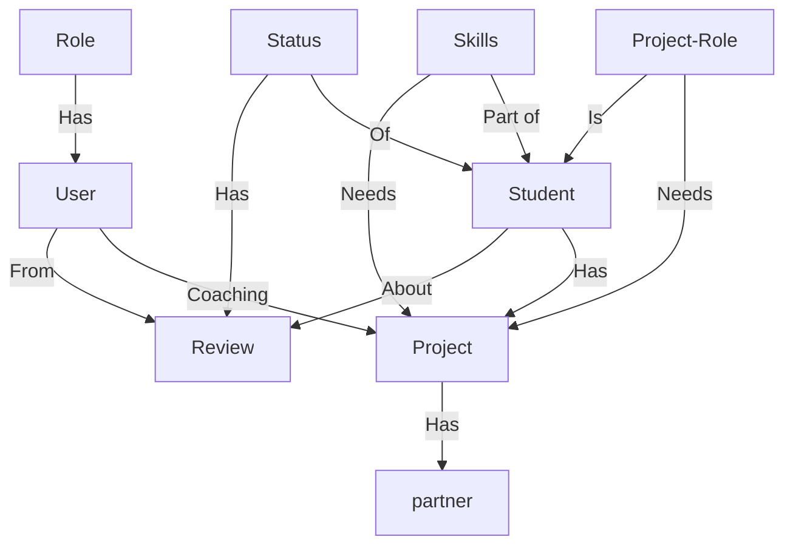

# Domain model

```mermaid
graph TD;
    A[Role]--Has-->B[User];
    B--From-->C[Review];
    D[Status]--Has-->C;
    D--Of-->E[Student];
    E--About-->C;
    G[Skills]--Needs-->F;
    G--Part of-->E;
    B--Coaching-->F[Project];
    E--Has-->F;
    H--Is-->E
    H[Project-Role]--Needs-->F;
    F--Has-->I[partner]
```