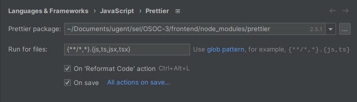
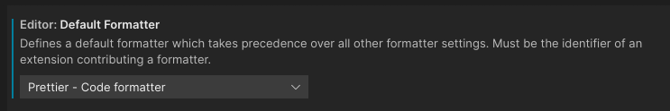
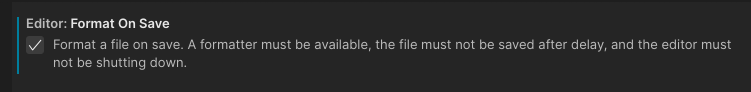

# Frontend

## Installing (and using) Yarn

*- What is my purpose?*

*- You install Yarn*

```bash
npm install --global yarn
```

:heavy_exclamation_mark: Do **not** use `npm` anymore! Yarn and npm shouldn't be used at the same time. 

```bash
# Installing new package
yarn add <package_name>

# Installing new package as a dev dependency
yarn add --dev <package_name>

# Installing all packages listed in package.json
yarn install
```

## Creating a `.env` file

We store information (such as the backend URL) in a `.env` file. In order to be able to work on the frontend, you need to create one yourself in the root of this directory.

You can copy the content of the `.env.example` file (present in this directory) which has default values that will work for development.

1. Create a file named `.env` in the root of this directory
2. Copy the content from `.env.example` into it

## Setting up Prettier and ESLint

This directory contains configuration files for `Prettier` and `ESLint`, and depending on your IDE you may have to install or configure these in order for this to work.

### Prettier

Prettier is a code formatter that enforces your code to follow a specific style. Examples include automatically adding semicolons (;) at the end of every line, converting single-quoted strings ('a') to double-quoted strings (`"a"`), etc.

### ESLint

ESLint is, as the name suggests, a linter that reviews your code for bad practices and ugly constructions.

### JetBrains WebStorm

When using WebStorm, Prettier and ESLint are supported by default. ESLint is enabled automatically if a `.eslintrc` file is present, but you _do_ have to enable Prettier in the settings.

1. Make sure the packages were installed by running `yarn install`, as `Prettier` and `ESLint` are among them.
2. In the search bar, type in "Prettier" (or navigate to `Languages & Frameworks > JavaScript > Prettier` manually).
3. If the `Prettier package`-field is still empty, click the dropdown. WebStorm should automatically list the Prettier from your local `node-modules` directory.
4. Select the `On 'Reformat Code' action` and `On save` checkboxes.



### Visual Studio Code

Visual Studio Code requires an extension for Prettier and ESLint to work, as they are not present in the editor.

1. Make sure the packages were installed by running `yarn install`, as `Prettier` and `ESLint` are among them

2. Install the [Prettier extension](https://marketplace.visualstudio.com/items?itemName=esbenp.prettier-vscode).

2. Install the [ESLint extension](https://marketplace.visualstudio.com/items?itemName=dbaeumer.vscode-eslint).

3. Select `Prettier` as the default formatter in the `Editor: Default Formatter` dropdown option.

	

4. Enable the `Editor: Format On Save` option.

	

5. The path to the `Prettier` config file, and the module in `node_modules` should be detected **automatically**. In case it isn't (see [Try it out!](#try-it-out), you can always fill in the fields in `Prettier: Config Path` and `Prettier: Prettier Path`.

### Try it out!

To test if your new settings work, you can try the following:

1. Create a new `TypeScript` file, with any name (for example `test.ts`)

2. In that file, add the following piece of code:

	```typescript
	export const x = 5 // Don't add a semicolon here
	
	export function test() {
	    // "variable" is never used, and never reassigned
	    let variable = "something";
	}
	```

3. Save the file by pressing `ctrl + s`
4. Prettier: you should see a semicolon being added at the end of the line automatically
5. ESLint: you should get a warning on `variable` telling you that it was never used, and also that it should be marked as `const` because it's never reassigned.
6. Don't forget to remove the `test.ts` file again :)

## Available Scripts

In the project directory, you can run:

### `yarn start`

Runs the app in the development mode.\
Open [http://localhost:3000](http://localhost:3000) to view it in the browser.

The page will reload if you make edits.\
You will also see any lint errors in the console.

### `yarn test`

Launches the test runner.

### `yarn build`

Builds the app for production to the `build` folder. It correctly bundles React in production mode and optimizes the build for the best performance.

The build is minified and the filenames include the hashes.
